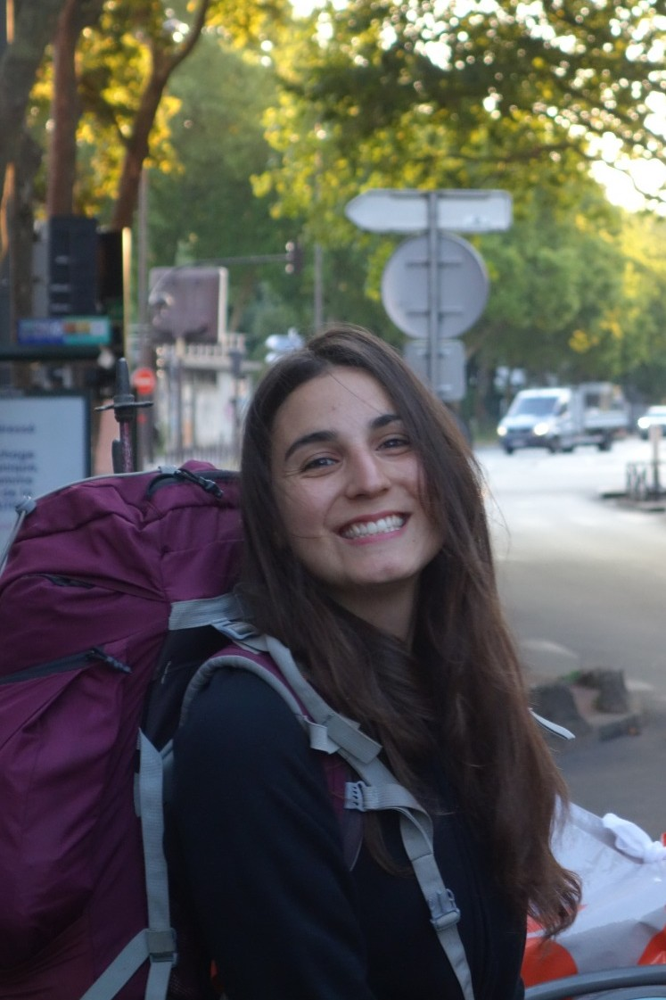

---
title: "Laurine Marty"
---

{width=200 style="border-radius: 50%; float: right;
  margin-left: 20px;"}

Hi there !

I’m a PhD student in the NeuroAI team at the Machine Learning Research Unit at TU Wien, where I’ve been working since September 2025 under the supervision of [Guillaume Bellec](https://guillaume.bellec.eu) . My research sits at the intersection of machine learning and neuroscience, with a focus on how deep learning can be adapted to better understand brain mechanisms.

I’m particularly interested in how theoretical neuroscience studies the dynamical organization of neural activity, and how latent dynamics relate to circuit structure and task complexity. My goal (modestly) would to bring these insights into self-supervised learning approaches for e-phys data. 

I would be pleased to chat about anything manifolds-related (or even loosely related, or not related at all), feel free to reach out, the contact button is just here.

  [→ See my projects](projects/index.qmd) | [→ Contact me](contact.qmd)

