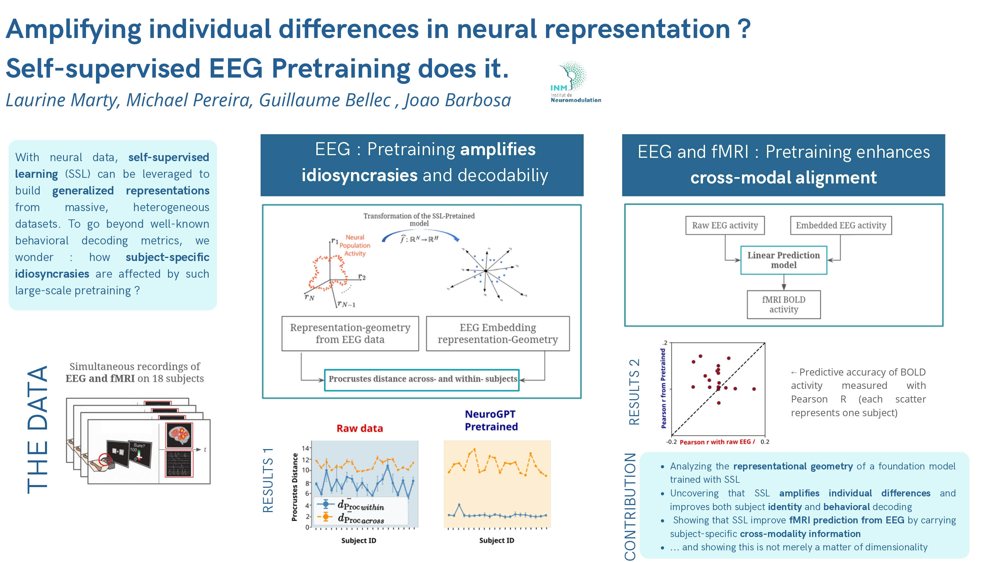

## Summary

Self-supervised learning can be leveraged to build generalized representations from massive and heterogeneous datasets.  In the case of neural data, trained models have been shown to generalize across domains, thus sometimes called foundation models. Generalization is typically measured with downstream decoding of behavior, such as movements.
Here, we replicate these benchmarks and provide a complementary evaluation to existing benchmarks for NeuroGPT, a foundation model of electroencephalography (EEG). Using simultaneous recording of EEG and BOLD signals over 18 human subjects, we test (1) the extent to which the model captures subject-specific idiosyncrasies, and (2) whether the model EEG embeddings improve the prediction of simultaneously recorded BOLD signals. We find that NeuroGPT embeddings reliably amplify individual idiosyncrasies and improve BOLD prediction relative to raw EEG and randomly initialized models. These results suggest that self-supervised pre-training enriches, rather than homogenizes, subject-level representational structure that can be leveraged to align different data modalities.

## Poster

{width=100%}

[Download poster (PDF)](../files/SSL_intersubject_poster.pdf){.btn
.btn-outline-primary}

## Paper

[Download paper (PDF)](../files/SSL_intersubject_paper.pdf){.btn .btn-primary}
## Authors

*ICLR Re-Align Workshop 2026* · [Laurine Marty](../index.qmd)^1^, [Michael Pereira](https://mpereira.me/)^2^, [Guillaume Bellec](https://guillaume.bellec.eu/)^1^,    
[Joao Barbosa](https://jbarbosa.org/)^3^                                                               
                                                                            
^1^ Machine Learning Research Unit & Neuromodulation Institute, TU Wien,      
Vienna, Austria                                           
^2^ Grenoble Institut Neurosciences, Univ. Grenoble Alpes, Inserm, Grenoble,
France                                                                        
^3^ Neuromodulation Institute & NeuroSpin, Inserm, Paris, France


```{=html}
<iframe src="../files/SSL_intersubject_paper.pdf" width="100%"
height="700px"></iframe>


